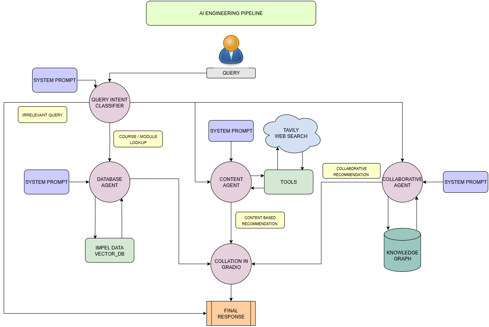
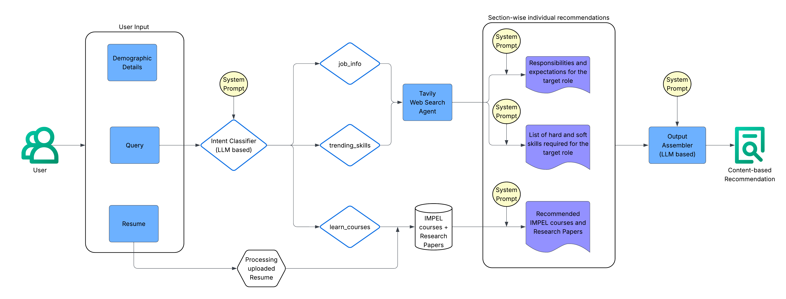

# Personalized Course Recommendation System

An AI-powered recommendation system designed for the Northeastern University community, specifically targeting students and professionals transitioning into Data Science and AI roles. This system combines sophisticated machine learning approaches with real-time market analysis to deliver personalized educational pathways.

## Overview

The system implements a multi-agent architecture that intelligently routes user queries through specialized recommendation engines based on intent classification. Each query is processed through one of three distinct pathways, ensuring optimal recommendation quality and relevance.

### AI Engineering Pipeline

The core architecture employs LangGraph for orchestration, managing workflow state and routing user queries to appropriate specialized agents:



The orchestrator performs intent classification using Cohere's LLM to determine whether a query requires database lookup, collaborative filtering, or content-based analysis, then routes accordingly through the appropriate agent workflow.

### Content-Based Recommendation Engine

For queries about trending skills, job market insights, and research-backed recommendations, the Content Agent integrates multiple data sources:



This agent processes uploaded resumes, performs web searches via Tavily for real-time market data, and utilizes a research paper vector store to provide evidence-based course recommendations with robust academic context.

### Collaborative Filtering Engine

For personalized learning path recommendations, the Collaborative Agent analyzes user similarity patterns stored in Neo4j:


By generating user vectors from profile data and finding similar learners, this engine recommends courses based on successful learning patterns of users with similar backgrounds and goals.

## Key Features

- **Intent-Aware Routing**: Intelligent query classification directs users to the most appropriate recommendation agent
- **Multi-Modal Input Processing**: Supports resume analysis (PDF/DOCX) alongside natural language queries
- **Real-Time Market Intelligence**: Integration with Tavily API for current job trends and skill demands
- **Research-Backed Recommendations**: Vector store of academic papers provides evidence-based course suggestions
- **Collaborative Intelligence**: Neo4j-powered user similarity matching for personalized learning paths
- **Comprehensive Logging**: Structured logging with error handling for production-ready deployment

## Getting Started

### Prerequisites

- Docker and Docker Compose
- Python 3.9+ (for local development)

### 1. Container Setup

Clone the repository and build the Docker environment:

```bash
git clone <repository-url>
cd course-recommendation-system

# Start containers
docker-compose up -d

# Verify containers are running
docker-compose ps
```

This creates MySQL and Neo4j containers with persistent data volumes.

### 2. Local Development Environment

Create a virtual environment for IDE support and remaining dependencies:

```bash
# Create virtual environment
python -m venv venv

# Activate virtual environment
source venv/bin/activate  # On Windows: venv\Scripts\activate

# Install dependencies
pip install -r requirements.txt
```

### 3. Configuration

Create your environment configuration file:

```bash
touch .env
```

Add the following configuration variables to your `.env` file:

**Required API Keys:**
```bash
COHERE_API_KEY=your_cohere_api_key_here
TAVILY_API_KEY=your_tavily_api_key_here
```

**Optional Database Settings** (uses defaults if not specified):
```bash
# MySQL Database
MYSQL_HOST=localhost
MYSQL_PASSWORD=your_mysql_password
MYSQL_DATABASE=course_recommendation

# Neo4j Graph Database  
NEO4J_PASSWORD=your_neo4j_password
NEO4J_URI=bolt://localhost:7687
```

Get your API keys from:
- **Cohere**: [dashboard.cohere.ai/api-keys](https://dashboard.cohere.ai/api-keys) for AI/LLM functionality
- **Tavily**: [app.tavily.com](https://app.tavily.com) for web search capabilities

### 4. Run the Application

```bash
python app.py
```

### 5. Access Web Interfaces

Once running, you can access these web-based services:

- **Main Application**: [http://localhost:7860](http://localhost:7860) - Gradio interface for course recommendations
- **Neo4j Browser**: [http://localhost:7474](http://localhost:7474) - Graph database interface to explore user relationships and data
- **MySQL** (if needed): Connect via your preferred MySQL client to `localhost:3306`

**Neo4j Login**: Use username `neo4j` and the password you set in your `.env` file (default: `neo4jpassword`)

## Developer Tools

### LangSmith MCP Integration

The project includes Model Context Protocol integration for LangSmith development tools. This provides direct access to dataset management, evaluation testing, and debugging traces through Claude Desktop during development.

**Quick Setup**: Add `LANGSMITH_API_KEY` to your `.env` file and configure Claude Desktop with the MCP server settings.

**Detailed Documentation**: See [.mcp/README.md](.mcp/README.md) for complete setup instructions, available tools, and usage examples.

### Logging System

The system implements a comprehensive logging structure via `SystemLogger`:

```python
from utils.logger import SystemLogger

# Different log levels with automatic context
SystemLogger.info("Processing user query", {
    'user_id': user_id,
    'query_preview': query[:50]
})

SystemLogger.error("Database connection failed", 
    exception=e,
    context={'connection_attempt': attempt_count}
)
```

**Log Hierarchy**: `DEBUG` → `INFO` → `ERROR` with automatic file rotation in `logs/` directory.

### Error Handling

Structured exception handling with custom exception types:

```python
from utils.exceptions import WorkflowError, APIRequestError

try:
    result = process_query(query)
except APIRequestError as e:
    SystemLogger.error("External API failure", exception=e)
    return fallback_response()
```

**Available Exceptions**: `WorkflowError`, `AgentExecutionError`, `APIRequestError`, `DatabaseConnectionError`, `ConfigurationError`

## Architecture Details

- **Orchestrator**: LangGraph-based workflow management with state persistence
- **Database Layer**: MySQL for course data, Neo4j for user interactions and similarity graphs
- **Vector Stores**: FAISS for course similarity, research paper retrieval
- **LLM Integration**: Cohere for intent classification and response generation
- **Web Interface**: Gradio for user interaction with file upload support

## Future Explorations

### LLM Fine-Tuning and Low-Level Optimization

Once sufficient runtime data is collected, the system is positioned for advanced optimizations:

- **Prompt Engineering**: Data-driven A/B testing of agent prompts using real user interaction patterns
- **Model Fine-Tuning**: Domain-specific fine-tuning on educational recommendation tasks using techniques like LoRA/QLoRA for memory-efficient training
- **Weight-Level Modifications**: Exploration of model architecture modifications for improved intent classification and response quality

Current prompts throughout the system (intent classification, content generation, collaborative filtering) represent baseline functional implementations. Production optimization requires runtime performance metrics and user feedback data to guide systematic improvements.

## License

This project is licensed under the MIT License.